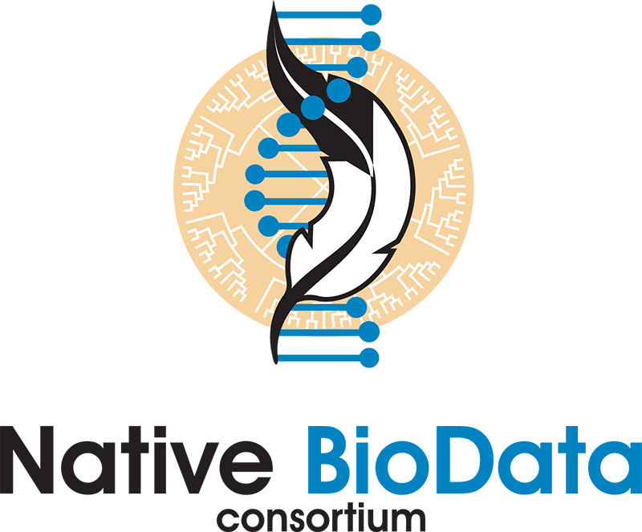
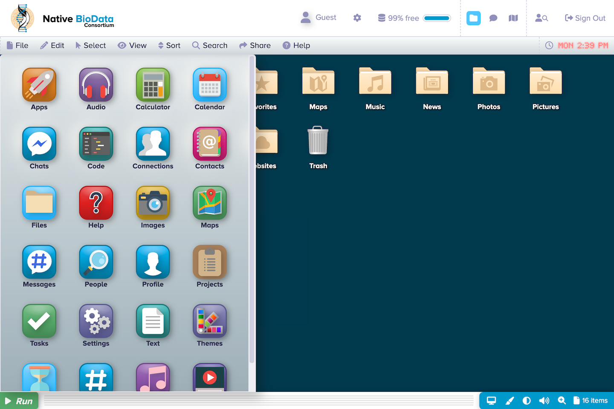

  

    
  

# Native BioData Portal

The native BioData Portal is a web application that allows uploading, managing, and sharing of various forms of data.  It provides an intuitive desktop like user interface experience combined with powerful tools for viewing, editing, and sharing data.

Welcome Screen

Desktop

## Requirements

### 1. PHP 8.1+

The data science map uses Laravel10 which relies upon PHP 8.1 or later.

### 2. Web Server

This application requires Apache or another similar web server.

### 2. SQL Database

The data science map uses SQL for storing user, authentication, and academic information.

## Installation

Please follow these [instructions](https://www.sharedigm.com/#help/setting-up) to install the Native BioData portal.

<!-- LICENSE -->
## License

Distributed under the Sustainable Use License which allows urestricted use of the software but does not allow you to commercialize it. See `LICENSE` for more information.

<!-- CONTACT -->
## Contact

Abe Megahed - (mailto:amegahed@wisc.edu) - email
